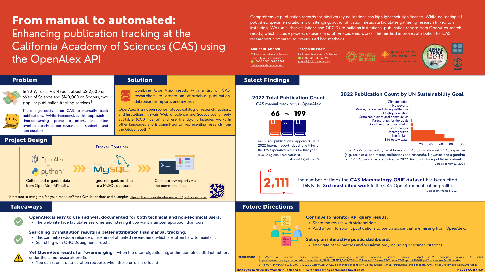

# publications_finder  
A tool to aggregate institutional publications, powered by the [OpenAlex API.](openalex.org)  

## Project Overview
  

# Instructions to run the program and generate csv reports:  

## Create the MySQL database and ingest publication data from OpenAlex. 
1. Clone this repository. 
2. cd to repository location and run `create_database.sh`
3. Set config options in config.ini. These include:  
    * institutional ROR id (required)  
    * email to be used for OpenAlex requests to get into the polite pool (optional, but recommended)  
    * ORCIDS of researchers to explicitly search for (useful when authors are missed by institutional affiliation search) (optional)    
4. Run `python main.py`  
    * automatically ingests new records on subsequent runs.

## Update publication data from OpenAlex (after the steps above have been completed).
1. Run `python main.py --update_works`

## Set up authors table in MySQL database & populate with records from a tab separated spreadsheet.  
NOTE: spreadsheet must be tab separated. The CAS sheet is [here.](https://docs.google.com/spreadsheets/d/19bmKGRyV2f6EcHfAov8WR9FQdjmf106UEVbw3OpRDJE/edit#gid=1862259444)  
1. To load all the author data for the first time into the authors database table:  
`python populate_authors.py --local_sheet_path [your path] --container_name [container name] --load_data`  
  * Where `[your path]` is the filepath of local downloaded spreadsheet with author records.  
  * And `[container name]` is the name of the Docker container.   
2. To update the authors table with modified records from the authors spreadsheet:  
`python populate_authors.py --local_sheet_path [your path] --container_name [container name] --update_data`  

## Use Cases and Examples:

### Find all CAS affiliated papers during a year interval or single year:
  * Saves a csv of query results.
  * Authors are concatenated into one field.
  * Most useful for counting total CAS papers and getting institutional overview. 

Run `python queries.py --from_year [year] --to_year [year]`  
e.g. `python queries.py --from_year 2022 --to_year 2022`

### Find all papers by their individual authors during a year interval or single year:
  * Saves a csv of query results.
  * Authors are exploded (papers will appear more than once)
    * e.g. publications are repeated for every author on that publication.
    * This is useful for further filtering and grouping by individual author names, roles, etc. 

Run `python queries.py --single_authors --from_year [year] --to_year [year]`  
e.g. `python queries.py --single_authors --from_year 2022 --to_year 2022`

### Find all CAS papers only from curators in a given year or year range.  

Run `python queries.py --single_authors --curators --from_year [year] --to_year [year]`  
e.g. `python queries.py --single_authors --curators --from_year 2022 --to_year 2022`

### Find all CAS papers only from non-curators in a given year or year range.   
Run `python queries.py --single_authors --from_year [year] --to_year [year]`  
e.g. `python queries.py --single_authors --from_year 2022 --to_year 2022`

### Find publications by department 
 Set `--department` to one of the following allowed values:  
  Anthropology  
  Aquarium  
  Botany  
  Center for Biodiversity and Community Science  
  Center for Comparative Genomics  
  Center for Exploration and Travel Health  
  Coral Regeneration Lab  
  Education  
  Entomology  
  Herpetology  
  Ichthyology  
  iNaturalist  
  Invertebrate Zoology and Geology  
  Microbiology  
  Ornithology and Mammalogy  
  Planetarium  
  Scientific Computing  

 Run `python queries.py --single_authors --department [department] --from_year [year] --to_year [year]`  
 e.g. `python queries.py --single_authors --department Botany --from_year 2022 --to_year 2022` 

### View journal information for any of the queries above.
  * Also saves a csv sorted by counts of papers by publisher + journal.  

Run `python queries.py --single_authors --department [department] --from_year [year] --to_year [year] --journal_info`  
 e.g. `python queries.py --single_authors --department Botany --from_year 2022 --to_year 2022 --journal_info` 

### View UN sustainability goals for any of the queries above.
  * Also saves a csv sorted by goal counts.

Run `python queries.py --single_authors --department [department] --from_year [year] --to_year [year] --sustainable_goals`  
 e.g. `python queries.py --single_authors --department Botany --from_year 2022 --to_year 2022 --sustainable_goals`   

### View proportion of open access vs closed access publications for any of the queries above.

Run `python queries.py --from_year [year] --to_year [year] --open_access_info`  
 e.g. `python queries.py --from_year 2022 --to_year 2022 --open_access_info`  

## Send out emails containing the above csv results.  
run `python send_emails.py` 

# Known issues
Duplicate rows generated by:
`python queries.py --from_year 2023 --to_year 2024`
Happens when the DOIs are the same but other data differ, probably
generating multiple rows from OpenAlex. Should write a consolidation 
heuristic, or flag said rows.

data error at OpenAlex - Charles F. Wilkinson reported for all 
Christine E. Wilkinson authorships. Check manually, perhaps create
a correction mechanism?

